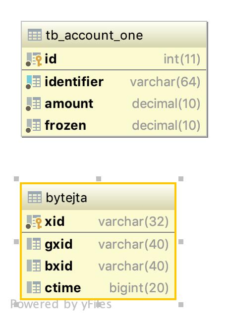

# 基于 ByteTCC 实现银行卡转账

* consumer 对客户提供转账服务
* provider 对 consumer 提供账户充值/扣款服务

## 数据字典

* provider 



* consumer


* 初始化 SQL （Mysql）

```sql
-- bytetcc 依赖
create table bytejta
(
	xid varchar(32) not null
		primary key,
	gxid varchar(40) null,
	bxid varchar(40) null,
	ctime bigint null
);

--  provider 服务的账户标
create table tb_account_one
(
	id int auto_increment
		primary key,
	identifier varchar(64) not null,
	amount decimal default 0 not null,
	frozen decimal default 0 not null,
	constraint tb_account_one_identifier_uindex
		unique (identifier)
);


-- consumer 服务的账户标
create table tb_account_two
(
	id int auto_increment
		primary key,
	identifier varchar(64) not null,
	amount decimal default 0 not null,
	frozen decimal default 0 not null,
	constraint tb_account_two_identifier_uindex
		unique (identifier)
);
```


